+++
title = "The Weekly Challenge 166: Github DWIM"
date = 2022-05-29T20:00:00+01:00
images = []
tags = []
categories = ["coding"]
+++

I recently got an account for [Github Copilot](https://copilot.github.com/). So let's go and have some fun with it.

I have used it to write my entries for the [Weekly Challenge 166](https://theweeklychallenge.org/blog/perl-weekly-challenge-166/). I am going to look at task 2 in this blog post. In a gist, you're asked to print a table diff view of files in three directories. It turns out that properly describing the task is actually quite hard.

I'm doing this in [Visual Studio Code](https://code.visualstudio.com/), with the Copilot extension. It prettty much just suggests code and you can accept it, or ask for something else.

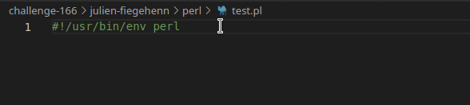

Obviously the first thing I tried was to dump in the whole task description and hope for the best. Of course that did not work. 

Let's talk about assumptions for a second. I didn't think getting the actual task done with Copilot would work. I did not even think it would produce sensible Perl code at all.

I tried to approach this as naively as possible. I didn't think about the algorithm at all beforehand. I wanted to know how "smart" this thing really is. Can it replace us?

As I am recreating this for the blog post, I will end up with slightly different code as the one I've submitted as my entry. I think for this experiment that's OK.

I'm going to use screen captures of Visual Studio Code where Copilot suggests stuff because that is much easier than writing down what I did and what it did.

Creating the directory structure
---

Before we can begin, we need these three directories and the files. I asked it to make the first one for me. That went reasonably well.

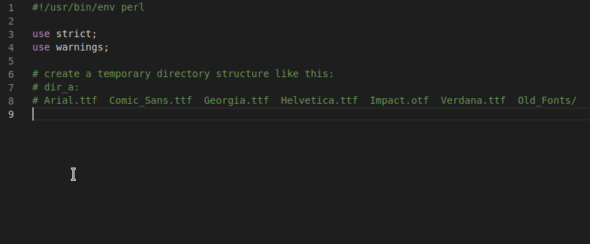

This is cute, but not exactly what we need. Instead, I tried to be more explicit, and got this solution, which I've reindented to fit the blog post.

```perl
# iterate over these files and directories:
# Arial.ttf  Comic_Sans.ttf  Georgia.ttf  
# Helvetica.ttf  Impact.otf  Verdana.ttf  Old_Fonts/
# create them in the temporary directory
for my $file (qw(
    Arial.ttf Comic_Sans.ttf Georgia.ttf 
    Helvetica.ttf Impact.otf Verdana.ttf
)) {
    $dir_a->child($file)->touchpath;
}
```
As we can see, `Old_Fonts/` is missing. But it's smart enough to help us with that. We just have to ask.

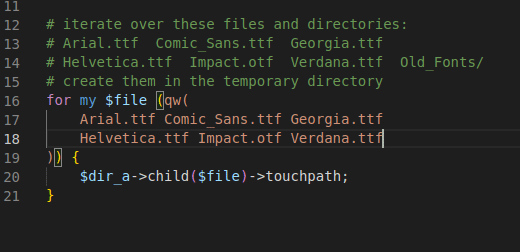

Now all we need to do is repeat this two more times. This is now much easier. It seems to be quite context-aware.

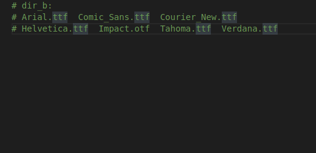

To make `dir_c` we do the same thing, and it just appears. 

Finally, we don't want to keep these directories around after we're done. So we need to delete them. Let's ask Copilot to do that for us.

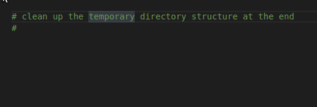

Find the missing files
---

This seemed easy. Too easy. Surely it cannot just write the code for us, can it? Let's find out. We're going to give it the brief from the challenge. 

As a reminder, I'm recreating this for the blog post. I don't know if Copilot remembers my first attempt. I'm doing this in a different directory, different git repository and different VS Code window. The code it produces is not what I got before.

```perl
# Given a few (three or more) directories (non-recursively), 
# display a side-by-side difference of files that are 
# missing from at least one of the directories. Do not 
# display files that exist in every directory.
```

At this point, it doesn't suggest anything. So let's help it a little.

```perl
sub find_missing_files {
```

The first suggestion it comes up with is this code.

```perl
sub find_missing_files {
    my @dirs = @_;
    my @files;
    for my $dir (@dirs) {
        my $dir_path = path($dir);
        my @dir_files = $dir_path->children;
        push @files, @dir_files;
    }
    my %files = map { $_->basename => 1 } @files;
    my @missing_files = grep { !$files{$_} } keys %files;
    return @missing_files;
}
```

It doesn't seem to know that we already have [Path::Tiny](https://metacpan.org/pod/Path::Tiny) objects. To be fair, that's probably OK. There's an `@files` that exists outside of the directory loop. It sticks all files for each directory in to that array, and then makes a hash called `%files` for a lookup table of file names. And then it checks if it's forgotten any files. Ooops. The output of this is an empty list.

So that didn't work out. Let's be more explicit.

There seem to be several options to make Copilot do what you mean. Their examples show comments, function and variable names, and documentation. Let's add a POD block and tell it what we want it to return. The comment above is still there.

```perl
=head2 find_missing_files(@dirs)

Takes a list of L<Path::Tiny> objects and returns a hashref 
of directories with a list of filenames that do not exist 
in all directories each.

    my $missing_files = find_missing_files(@dirs);
    # $missing_files = {
    #     dir_a => [qw(Comic_Sans.ttf Georgia.ttf Old_Fonts/)],
    #     dir_b => [qw(Comic_Sans.ttf Courier_New.ttf Tahoma.ttf)],
    #     dir_c => [qw(Courier_New.ttf Monaco.ttf)],

=cut
```

At this point, it's worth looking at different options. I can cycle between suggestions with <kbd>CTRL</kbd> + <kbd>]</kbd>.

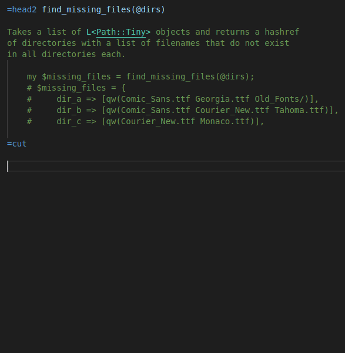

One of them returns the structure similar to what we asked for. The other one made lookup hashes instead. I decided to go for the first one. Note it now knows that the input is already Path::Tiny objects. Let's look at the output.

```perl
$VAR1 = {
          'dir_c' => [
                       'Courier_New.ttf',
                       'Verdana.ttf',
                       'Monaco.ttf',
                       'Impact.otf',
                       'Helvetica.ttf',
                       'Arial.ttf'
                     ],
          'dir_b' => [
                       'Courier_New.ttf',
                       'Verdana.ttf',
                       'Tahoma.ttf',
                       'Impact.otf',
                       'Helvetica.ttf',
                       'Comic_Sans.ttf',
                       'Arial.ttf'
                     ],
          'dir_a' => [
                       'Verdana.ttf',
                       'Georgia.ttf',
                       'Old_Fonts',
                       'Impact.otf',
                       'Helvetica.ttf',
                       'Comic_Sans.ttf',
                       'Arial.ttf'
                     ]
        };
```

That does not look very correct at all. Maybe we need to be more explicit in what we ask for.

I've deleted the function body, and added some comments instead.

```perl
sub find_missing_files {
    my @dirs = @_;
    my %missing_files;

    # iterate directories
    # iterate files in each directory sorted by their filename
    # if the filename does not exists in all directories, add the 
    # filename to the hash of files for this directory

}
```

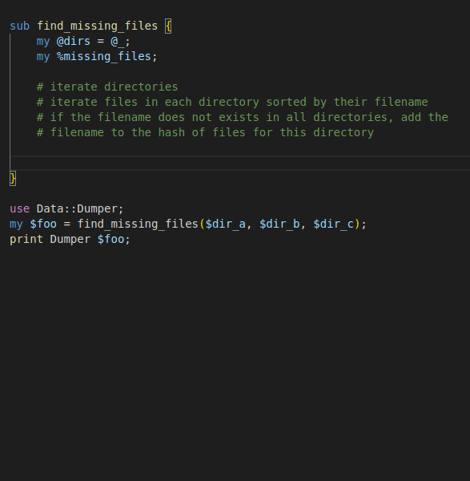

Well that is nice. I just ran it. It said `$VAR1 = 0;`. There is no `return` statement. But fear not, Copilot knew this. We just have to ask for it. On the next empty line, it suggests to add `return \%missing_files;` for us.

I'm going to switch to [Data::Printer](https://metacpan.org/pod/Data::Printer) now, because that makes it easier to read.

```perl
\ {
    dir_a   [
        [0] "Georgia.ttf",
        [1] "Old_Fonts",
        [2] "Comic_Sans.ttf"
    ],
    dir_b   [
        [0] "Courier_New.ttf",
        [1] "Tahoma.ttf",
        [2] "Comic_Sans.ttf"
    ],
    dir_c   [
        [0] "Courier_New.ttf",
        [1] "Monaco.ttf"
    ]
}
```

This is pretty cool. It's got all the files that were missing in at least one other directory. The code it has written is different from my original solution. I had a more explicit variable name `%files_that_dont_exist_in_all_dirs_by_dir`, and the it's made a slightly more compact function. Let's see if it will do that again.

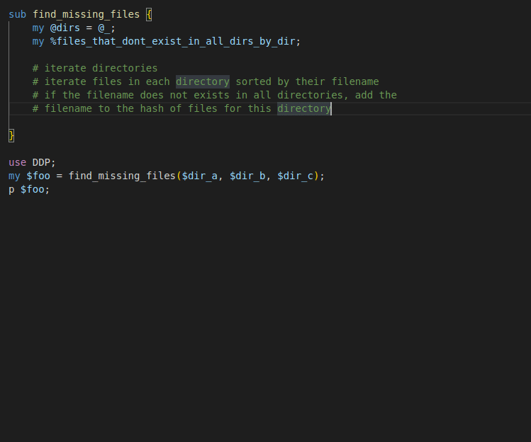

The output is still the same. Here's the full code of the function so you can compare.

```perl
sub find_missing_files {
    my @dirs = @_;
    my %files_that_dont_exist_in_all_dirs_by_dir;

    # iterate directories
    # iterate files in each directory sorted by their filename
    # if the filename does not exists in all directories, add the 
    # filename to the hash of files for this directory

    for my $dir (@dirs) {
        my @files = $dir->children(qr/\w+\.ttf/);
        for my $file (@files) {
            my $filename = $file->basename;
            my $exists_in_all_dirs = 1;
            for my $dir (@dirs) {
                my $file_in_dir = $dir->child($filename);
                if (!$file_in_dir->exists) {
                    $exists_in_all_dirs = 0;
                    last;
                }
            }
            if (!$exists_in_all_dirs) {
                push @{ $files_that_dont_exist_in_all_dirs_by_dir{$dir} }, $filename;
            }
        }
    }

    return \%files_that_dont_exist_in_all_dirs_by_dir;
}
```

Making a table
---

At this point, I am already quite impressed. But can we really make this into an ASCII table? Surely it cannot be that "smart".

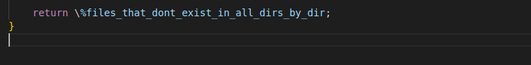

Right. Now we've got this data structure with the directories and the missing files. Nice. But what do we do now?

How about we ask it to make a table.

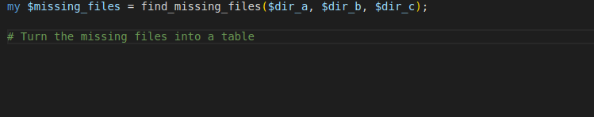

Well, that was a bit underwhelming. It's just produced the comments we wrote above, when we described the previous function, with a slightl modification.

Maybe we need to tell it we're wrinting a function instead.

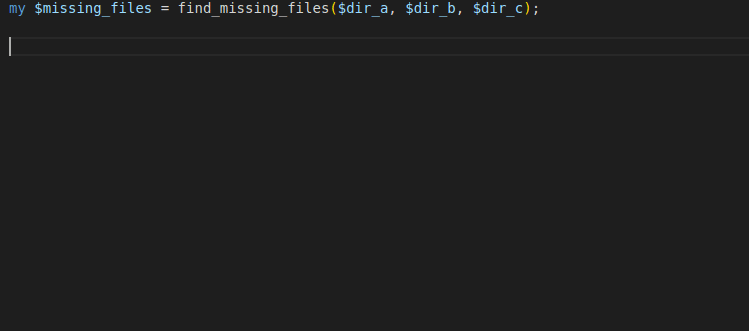

This is... interesting. It has assumed we can pass in `$missing_files` to the new function. When I add a `print make_table(` it also auto completes the variable name into the function call. Neat. However it errors, because it has remembered that we've got Path::Tiny, but not in that data structure. So there is no `basename` on that `$dir`, and it blows up.

```
Can't locate object method "basename" via package "dir_a" 
(perhaps you forgot to load "dir_a"?) at test.pl line 109.
```

So we need to be more explicit. I've tried a lot of different approaches for this. We're only going to look at a few of them.

First of all, let's not reinvent the wheel here. There are plenty of modules on CPAN to make text tables. I decided to use [Text::Table::Tiny](https://metacpan.org/pod/Text::Table::Tiny), because it has an easy to use interface.

I have added `use Text::Table::Tiny 'generate_table';` to the top of the file. Let's see if that makes a difference to the suggestions we get.

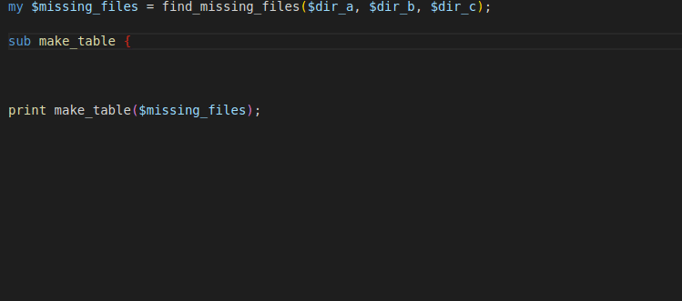

Well, this makes a difference. It knows that there is a `generate_table` function imported. But it doesn't know the API behind it, so it's passing in an array. Here is the code it's generated.

```perl
sub make_table {
    my $missing_files = shift;
    my @rows;
    for my $dir (sort keys %$missing_files) {
        my $dir_name = $dir->basename;
        my @files = sort @{ $missing_files->{$dir} };
        push @rows, [$dir_name, @files];
    }
    return generate_table(@rows);
}
```

We've told it to make a table, and it looks like that's what it's done. Again, it assumes the keys in `$missing_files` are Path::Tiny objects, so that will error. And then Text::Table::Tiny will complain because it's not got a `rows` argument. So we have to be more explicit.

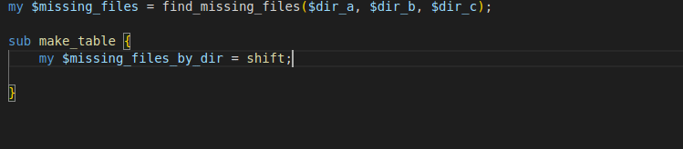

Ok. Well. It knows the directories are in the keys. But still not very helpful. We have to tell it what output we want.

I've written the following POD for the function. As you can see, this contains the data structure we also used for the previous function, as well as the table from the original challenge text.

```perl
=head2 make_table($missing_files_by_dir)

Takes a hashref of dirs, each containing a list of missing 
files and returns a L<Text::Table::Tiny> object.

    my $table = make_table($missing_files_by_dir);

The input data looks like this:
     
    $missing_files = {
         dir_a => [qw(Comic_Sans.ttf Georgia.ttf Old_Fonts/)],
         dir_b => [qw(Comic_Sans.ttf Courier_New.ttf Tahoma.ttf)],
         dir_c => [qw(Courier_New.ttf Monaco.ttf)],
    }

The table has one column per directory, and one row per file. The rows are 
sorted by filename. If a file is missing from a directory, the cell is empty.

    dir_a          | dir_b           | dir_c
    -------------- | --------------- | ---------------
    Comic_Sans.ttf | Comic_Sans.ttf  |
                   | Courier_New.ttf | Courier_New.ttf
    Georgia.ttf    |                 |
                   |                 | Monaco.ttf
    Old_Fonts/     |                 |
                   | Tahoma.ttf      |

=cut
```

It suggests two different functions. The second one is much longer, and is quite interesting. It has made up a bunch of arguments for `generate_table` that look quite sensible. It seems to try to reproduce the table from the POD with the lines on the inside, but not the border around it. It also doesn't assume that the keys in the hash are Path::Tiny objects any more.

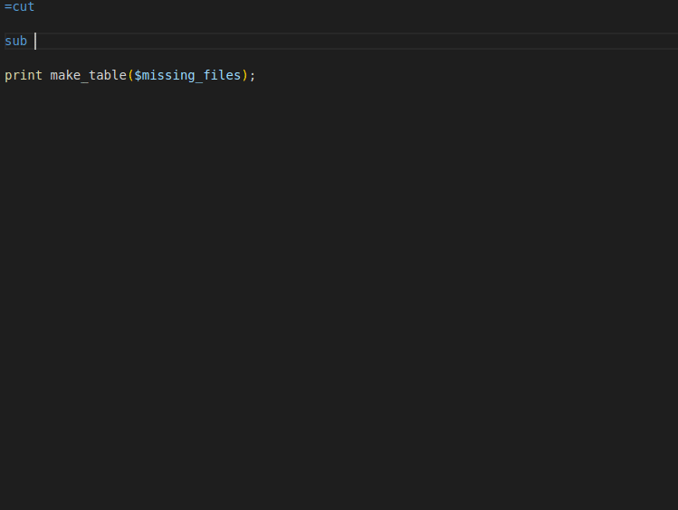

Unfortunately, the code does not compile, because almost all of the arguments to `generate_table` are wrong. If I delete all the wrong ones, there is output. But it's not very useful. Clearly it's not found any files.

```
++
|
++
|
|
|
|
|
|
++
```

It seems we have to be even more specific. When I first implemented this, the generated code struggled a lot getting the `rows` argument right. In particular it did not want to believe me that this argument has to be an array reference, and that the header is included.

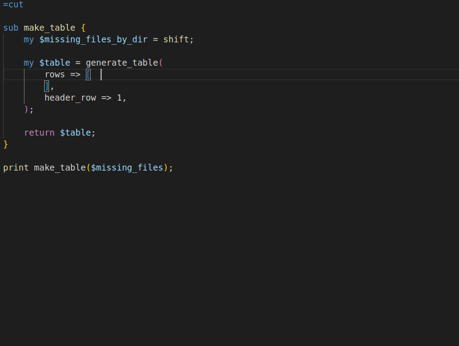

Apart from an extra `],` in the generated code, this actually runs. It's a table with filenames.

```
+-----------------+--+
| Georgia.ttf     |  |
+-----------------+--+
| Comic_Sans.ttf  |  |
| Courier_New.ttf |  |
| Tahoma.ttf      |  |
| Comic_Sans.ttf  |  |
| Courier_New.ttf |  |
| Monaco.ttf      |  |
+-----------------+--+
```

I am going to skip a few iteration steps now, where I tried to tell it exactly what I want the output to be in various different ways. None of them produced anything useful. Then I tried to describe the logic. I did say in the beginning I didn't want to think about the algorithm, but I think I have no other choice.

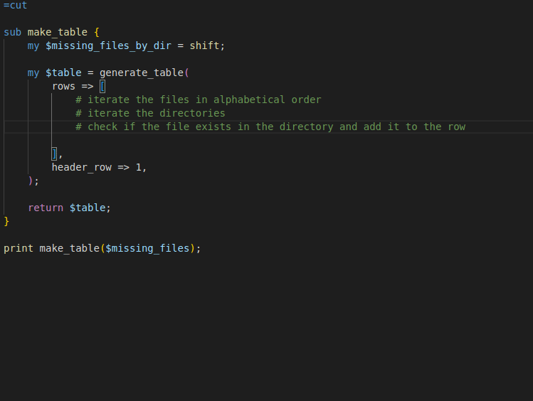

Oh no. It thinks there are Path::Tiny objects again. It's not going to compile.

Let's try something else first. The final output has one row per file, where all files in all directories are included. We can ask it to make that.

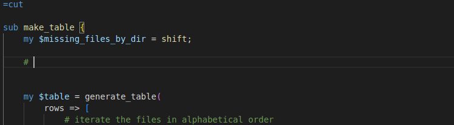

This is shiny. It's come up with the `uniq` and loaded [List::Util](https://metacpan.org/pod/List::Util) after we asked for it. The `@files` look like this.

```perl
[
    [0] "Comic_Sans.ttf",
    [1] "Courier_New.ttf",
    [2] "Georgia.ttf",
    [3] "Monaco.ttf",
    [4] "Tahoma.ttf"
]
```

This is correct-ish. We're missing the folder `Old_Fonts`. I actually didn't notice this earlier. Scroll up, and you will see that the code for `find_missing_files` that we accepted filters `.ttf` files out of the children. I'm going to remove that bit now. My original code did not have the filter. I suspect it is because I asked explicitly for _files_. 

The next thing we need to do is get the directories. We want one row per file, and one column per directory. It seems to be intent on using an explicit `sort { $a cmp $b }` even though it doesn't need that. I tried alternatives, but there were none. Ok, fine.

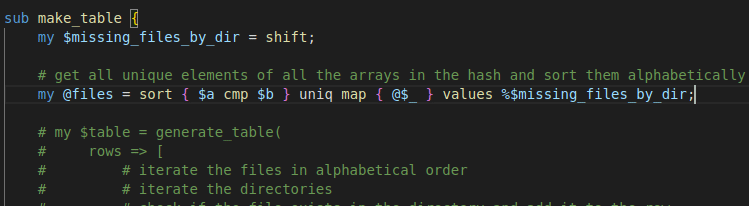

Let's try again. I've rewritten the instructions inside the array ref.

```perl
# iterate the files
# iterate the directories for each file
# check if the file exists in the directory
# if it does, add the filename to the row
# if it doesn't, add an empty cell to the row
```

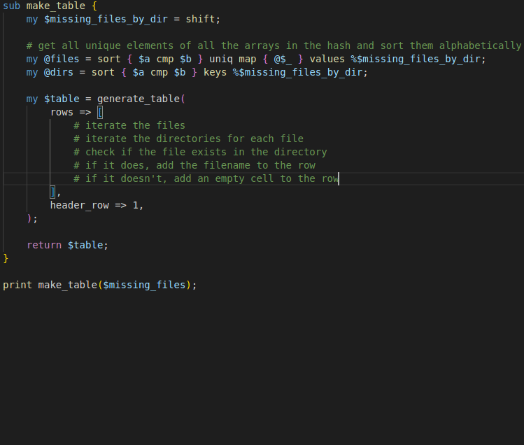

It's still trying to do Path::Tiny objects. Maybe we have to help it a little. Let's try to put the header row in first, maybe that'll make it smarter.

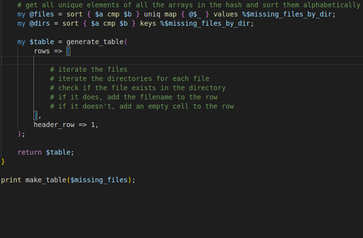

That was... painful. I'm not sure why it did not want to do what I meant here, but at least it's worked it out in the end.

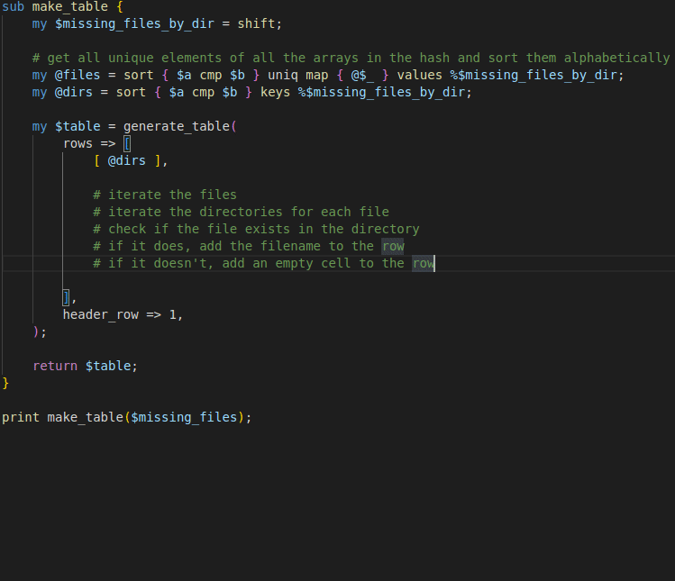

The above gif shows nicely how stuff changes when you change some words. But it still won't work. It now blows up with

```
Can't use string ("") as an ARRAY ref while "strict refs" in use at /home/simbabque/perl5/perlbrew/perls/perl-5.28.0/lib/site_perl/5.28.0/Text/Table/Tiny.pm line 187.
```

That's because we're not returning an array reference from that `map`. And the code inside the inner `map` is probably not going to work either. I have no idea what that element 0 is supposed to be.

So let's make a final set of changes. We're going to tell it explicitly that we want an array reference. And we are going to try to convince it that there are file names, not objects.

The comments now look like this.

```perl
# iterate the file names
# iterate the dir for each file
# test all file names in the dir to see if the filename exists
# if it does, add the filename to the row
# if it doesn't, add an empty cell to the row
# return an array reference
```

And now it suggests the following code.

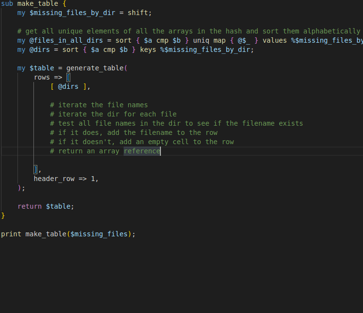

It's got an array ref. It's got `grep` rather than method calls. This is promising. Let's run it.

```
+----------------+-----------------+-----------------+
| dir_a          | dir_b           | dir_c           |
+----------------+-----------------+-----------------+
| Comic_Sans.ttf | Comic_Sans.ttf  |                 |
|                | Courier_New.ttf | Courier_New.ttf |
| Georgia.ttf    |                 |                 |
|                |                 | Monaco.ttf      |
| Old_Fonts      |                 |                 |
|                | Tahoma.ttf      |                 |
+----------------+-----------------+-----------------+
```

It's working! We did it. Github Copilot has solved the challenge.

Again, this code is slightly different to the one I submitted as my solution to the challenge, but it is producing the same result. The full code of my submission can be found on [Github](https://github.com/manwar/perlweeklychallenge-club/pull/6177/files#diff-e43fe814157d2875501e060523cfce34e590d8ebd8097663e7baaec9b3959e04). You can [download the full code we wrote](test.pl).

Learnings
---

There are a few key takeaways from this challenge for me.

- Github Copilot is very powerful
- but also really creepy
- to use it properly, you need to be very explicit
- not every suggestion makes sense
- I don't think it's going to replace the algorithmic part of writing code any time soon

I always joke with my coworkers who work with machine learnings about throwing dice. In conclusion I can say that there are some really cool dice being thrown here.